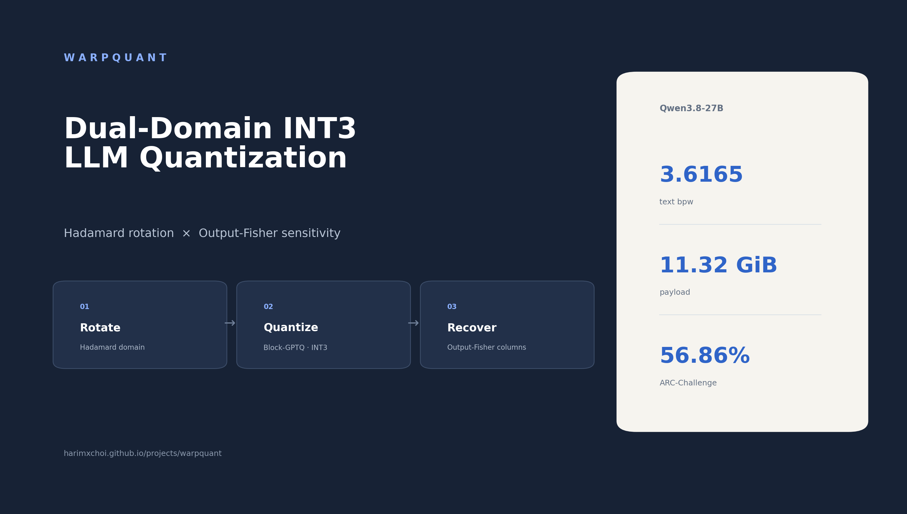
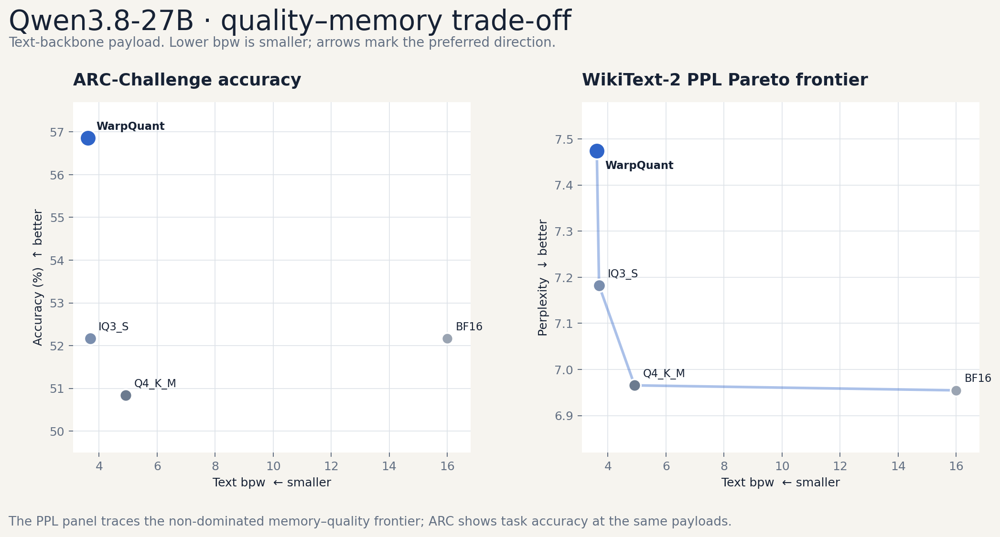

# WarpQuant: Dual-Domain LLM Quantization via Hadamard Rotation and Output-Fisher Sensitivity

WarpQuant is an INT3 post-training quantization method for LLMs. It quantizes projection weights after a signed Hadamard rotation, reconstructs them in the original coordinates, and spends a small recovery budget on columns ranked by next-token loss sensitivity.

[Technical report](https://harimxchoi.github.io/projects/warpquant) · [Qwen3.8-27B VLM](https://huggingface.co/HarimxChoi/WarpQuant-Qwen3.8-27B-R16E4H4) · [Qwen3.8-27B text model](https://huggingface.co/HarimxChoi/WarpQuant-Qwen3.8-27B-R16E4H4-Text)



## Installation

```bash
pip install git+https://github.com/HarimxChoi/WarpQuant
```

## Method

WarpQuant separates the domain used for compression from the domain used for recovery:

$$
R = HD, \qquad \widetilde{W} = Q_3(WR^T)R, \qquad E = W-\widetilde{W}.
$$

The recovery score combines input energy, quantization residual, and diagonal Output-Fisher sensitivity:

$$
S_c = \frac{H_{X,cc}\,E_{:,c}^{T}\operatorname{diag}(H_G)E_{:,c}}
{16d_{out}+32}.
$$

```python
from warpquant import output_fisher_score, recover_columns, select_weak_columns

scores = output_fisher_score(weight, base_weight, activations, output_fisher)
columns = select_weak_columns(scores, count=64)
recovered = recover_columns(base_weight, weight, columns)
```

`warpquant.py` also includes a normalized FWHT, signed Hadamard rotation, and dynamic per-token INT8 activation quantization.

## Qwen3.8-27B benchmark

All rates use the 26,895,998,464-parameter text backbone as the denominator. Commonsense is the macro average of fixed 1,000-example HellaSwag, WinoGrande, and PIQA screens.

| Format | Text bpw | Payload | WT2 PPL ↓ | ARC-299 ↑ | MMLU-13,943 ↑ | Commonsense ↑ | GSM8K-500 flex ↑ |
|---|---:|---:|---:|---:|---:|---:|---:|
| BF16 | 16.00 | 50.11 GiB | 6.9548 | 52.17 | 43.07 | 79.23 | 70.40 |
| Q4_K_M | 4.92 | 15.41 GiB | 6.9656 | 50.84 | 42.90 | 79.23 | 75.20 |
| IQ3_S | 3.6940 | 11.57 GiB | 7.1820 | 52.17 | 42.97 | 78.83 | 59.40 |
| **WarpQuant R16E4H4** | **3.6165** | **11.32 GiB** | **7.4737** | **56.86** | **42.72** | **78.83** | **61.00** |

GSM8K uses the same first 500 examples with 5-shot prompting. The table reports lm-evaluation-harness flexible-extract accuracy; strict-match scores are preserved in the released result archive.



## KV cache and activation ablation

| Configuration | PPL ↓ | Δ PPL | Top-1 | KV compression @ 512 |
|---|---:|---:|---:|---:|
| Weight-only | 6.6468 | — | reference | 1.00× |
| + K4/V4/R128 | 6.6495 | +0.0027 | 97.65% | 2.14× |
| + Dynamic A8 | 6.7139 | +0.0671 | 92.10% | 1.00× |
| **+ K4/V4/R128 + A8** | **6.6945** | **+0.0477** | **92.47%** | **2.14×** |

## Reproduction

```bash
pip install -r requirements.txt
bash benchmarks/run_text_metrics.sh
bash benchmarks/run_commonsense.sh
bash benchmarks/run_gsm8k_500.sh
bash benchmarks/run_kv_activation.sh
```

The fixed task definitions, summarizers, and KV/A8 reference code used for the tables are in [`benchmarks/`](benchmarks/).

## Citation

```bibtex
@misc{choi2026warpquant,
  author = {Harim Choi},
  title  = {WarpQuant: Dual-Domain LLM Quantization via Hadamard Rotation and Output-Fisher Sensitivity},
  year   = {2026},
  url    = {https://github.com/HarimxChoi/WarpQuant}
}
```
